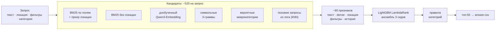

# Кандидатогенерация для поиска услуг Авито

**Итог: Recall@50 = 0.9307** на бенчмарке.

Задача: по поисковому запросу (текст, локация, фильтры, категория) отобрать из корпуса 189 тыс. объявлений до 50 кандидатов, среди которых окажутся объявления, выбранные пользователем.

## Коротко о решении



1. **Кандидаты.** Несколько независимых ретриверов дают около 520 объявлений на запрос. В этом наборе оказывается 97.7% правильных ответов.
2. **Ранжирование.** LightGBM LambdaRank выбирает из них 50 по ~60 признакам: тексту, dense-сходству, локации и расстоянию, фильтрам, истории объявления.
3. **Главный текстовый сигнал** — модель `Qwen/Qwen3-Embedding-0.6B`, дообученная на парах «запрос → выбранное объявление» из train: сначала с in-batch негативами, затем с hard negatives из той же локации.

| Попытка | Конфигурация | Прогноз по валидации (`R@35w`) | Лидерборд | Файл |
|---|---|---|---|---|
| 1 | дообученный e5-small + LightGBM | 0.9261 | 0.9163 | [`attempt1_lb0.9163.csv`](results/submissions/attempt1_lb0.9163.csv) |
| 2 | Qwen3-Embedding + hard negatives, энкодеры на половине train | 0.9390 | 0.9239 | [`attempt2_lb0.9239.csv`](results/submissions/attempt2_lb0.9239.csv) |
| 3 | **то же, энкодеры переобучены на всём train** | 0.9390 | **0.9307** | [`answer.csv`](answer.csv) |

---

## 1. Данные и признаки

### Что показал анализ данных
Скрипты — в [`experiments/`](experiments/), выводы — ниже.

| Наблюдение | Как использовано |
|---|---|
| train: 497 673 пары «запрос → выбор», 74.5 тыс. уникальных текстов; бенчмарк: 2 452 запроса, все тексты уникальны | валидация строится по одному запросу на уникальный текст |
| корпус бенчмарка устроен как «все выбранные объявления отложенной части лога»: лишь 5% объявлений train есть в корпусе, 9.6% корпуса встречались в train | разбиение для валидации — по объявлениям (`scripts/split.py`); история объявления — признак, но не основа |
| **83% пар — объявление из той же локации**, что и поиск; поиск по региону (107620 «Москва и область») ведёт в город; у 17% запросов бенчмарка в их локации нет ни одного объявления | локация — **приор** P(локация объявления \| локация поиска) и расстояние до центра, а не жёсткий фильтр (фильтр теряет 8–23% ответов) |
| фильтры почти жёсткие: «Вид услуги» совпадает в 98.5% пар, «Тип услуги» — в 94.6%, «рейтинг 4+» — в 99% | признаки совпадения с фильтрами |
| **63% текстов бенчмарка не встречались в train**, запросы короткие (3 слова) и хвостовые | дообученный семантический энкодер; перенос опыта от похожих запросов лога (kNN) |
| 9% запросов бенчмарка — без категории (`search_category = 0`), в train их почти нет; для них в корпусе есть товары и вакансии («Аэрограф для ногтей», «Инженер ПТО») | правила категорий (раздел 2.4) |
| train — весна и лето (кондиционеры, покос, вспашка), бенчмарк — конец лета и осень («школа», «1 сентября»); в тесте появились новые ключи фильтров | ключи добавлены в парсер; признаки, привязанные к счётчикам, нормированы; эффект учтён в метрике отбора (раздел 3) |

### Признаки ранкера
Реализация — [`src/pipeline.py`](src/pipeline.py).

| Группа | Признаки | Зачем |
|---|---|---|
| Текст | BM25 по заголовку, параметрам, описанию и всему вместе (сырой и нормированный); доля слов запроса в заголовке и во всём тексте; символьные 3-граммы | лексическое совпадение; опечатки |
| Dense | косинус запрос–объявление для Qwen3 и e5-small; отставание от 50-го по корпусу | семантика там, где слова не совпадают |
| Локация | log P(локация объявления \| локация поиска), счётчик пары локаций, «та же локация», расстояние до центра локации поиска | **самая важная группа**: расстояние — признак №1 по важности |
| Фильтры | совпадение «Вид услуги», «Тип услуги», рейтинга, прочих фильтров (1 / 0 / фильтра нет) | фильтры почти всегда выполняются |
| Приоры микрокатегории | P(микрокатегория \| точный текст запроса); наивный Байес «слово → микрокатегория»; распределение микрокатегорий у похожих запросов (kNN) | что обычно выбирают по такому запросу |
| История объявления | сколько раз выбирали; пересечение прошлых запросов с текущим; был ли ровно такой запрос | сильный сигнал для 9.6% корпуса |
| Объявление | рейтинг, число отзывов, цена, скрыт ли телефон, запрещены ли сообщения, длина текста | качество и популярность |
| Запрос | число слов, частота текста в логе, есть ли фильтры, категория 0, объём лога по локации | контекст для взаимодействий |
| Ранги | ранг внутри запроса для BM25, dense, n-грамм, приоров | не зависят от масштаба скоров при смене энкодера |

Все счётчики нормируются на размер лога: ранкер учится на признаках от половины train, а на бенчмарке история — весь train.

---

## 2. Модели и алгоритмы

### 2.1. Кандидаты
Объединение ретриверов, итого ~520 объявлений на запрос. Потолок полноты кандидатов — 0.977.

| Ретривер | Кандидатов | Для чего |
|---|---|---|
| BM25 (все поля) + приор локации | 200 | основной лексический поиск |
| BM25 (заголовок) + приор локации | 80 | короткие точные совпадения |
| BM25 без локации | 40 | онлайн- и выездные услуги из других городов |
| Dense + приор локации / глобально | 150 / 40 | семантический поиск |
| Гибрид dense + BM25 + локация | 300 | лучший одиночный ретривер |
| Символьные 3-граммы TF-IDF + локация | 60 | опечатки |
| Популярные объявления вероятных микрокатегорий + локация | 60 | запросы без хороших текстовых совпадений |
| kNN по похожим запросам лога (PRF по заголовкам выбранных объявлений) | 60 | перенос опыта на новые запросы |

### 2.2. Дообучение энкодеров
Разделы 2–4 [`solution.ipynb`](solution.ipynb).
- **Данные:** пары «запрос (+ текст фильтров) → выбранное объявление», не больше 20 пар на один текст запроса. Текст объявления — заголовок, параметры услуги и 300 символов описания.
- **Функция потерь:** симметричный InfoNCE (температура 0.05), in-batch негативы. В батче нет повторов запросов и объявлений, чтобы не было ложных негативов.
- **Hard negatives (второй раунд).** Энкодер первого раунда ищет для каждого запроса топ-60 объявлений с учётом приора локации. Выбранные по этому тексту объявления исключаются, негатив берётся с позиций 3–30: первые позиции пропускаются, там много «ложных негативов».
- **Тест на масштаб** (dense-поиск с приором локации, метрика `dR@35wloc`):

| Энкодер | Параметров | `dR@35wloc` |
|---|---|---|
| multilingual-e5-small | 118M | 0.789 |
| multilingual-e5-base | 278M | 0.789 |
| deepvk/USER-bge-m3 | 359M | 0.801 |
| multilingual-e5-large | 560M | 0.818 |
| Qwen3-Embedding-0.6B | 600M | 0.823 |
| **Qwen3-Embedding-0.6B + hard negatives** | 600M | **0.838** |

### 2.3. Ранкер
LightGBM, `objective=lambdarank`, 63 листа, learning rate 0.05, 400 деревьев, `lambdarank_truncation_level=60`, ансамбль из 3 сидов. Обучение на 15 тыс. запросов псевдо-бенчмарка; для финала добавляются 3 тыс. валидационных. LambdaRank выбран сравнением: он даёт 0.944 против 0.916 у xendcg и 0.895 у бинарной классификации.

### 2.4. Правила категорий
- Запрос в категории «Услуги» (114): объявления других категорий отбрасываются.
- Запрос без категории (0): до 15 слотов резервируются под объявления других категорий с хорошим текстовым совпадением. Ранкер обучен на мире, где таких объявлений нет, и сам их занижает.

### 2.5. Что проверено и не вошло
| Идея | Результат |
|---|---|
| Cross-encoder `BAAI/bge-reranker-v2-m3` вторым проходом по топ-100 (дообучен на hard negatives) | +0.02 п.п. — не вошёл. В одиночку ранжирует плохо (0.666): не видит локацию, а среди топ-100 почти все подходят по тексту |
| Признаки «нелокальности» запроса и «удалённой» услуги | −0.17 п.п. |
| e5-base вместо e5-small | без прироста |
| e5-small вторым dense-признаком к Qwen | +0.08 п.п. R@50 (в пределах шума), оставлен |
| Бинарная классификация вместо LambdaRank | −5 п.п. |
| Адаптация энкодера к корпусу без разметки ([`experiments/06_notebook_addons/adapt.py`](experiments/06_notebook_addons/adapt.py)) | эксперимент, в итоговый сабмит не входит |

---

## 3. Как проверялось качество до отправки

**Псевдо-бенчмарк из train** ([`scripts/split.py`](scripts/split.py)) повторяет устройство бенчмарка:
- объявления train делятся по хешу `item_id`: 64% образуют корпус (178 тыс. — близко к 189 тыс. бенчмарка), на остальных учатся все модели;
- ~8% объявлений корпуса имеют историю в обучающей части (в бенчмарке 9.6%);
- 3 000 валидационных запросов, по одному на уникальный текст, 37% из них встречались в обучающей части — как в бенчмарке; ещё 15 000 запросов для обучения ранкера.

**Без утечек.** Всё, что даёт признаки ранкеру на валидации (энкодеры, приоры, история, cross-encoder), обучается только на обучающей части. Для второго прохода ранкера скоры первого считаются out-of-fold по фолдам запросов.

**Метрика, близкая к лидерборду.** После первой отправки (val 0.945 → LB 0.916) разрыв был разложен на части:
- определение релевантности у бенчмарка то же: если бы релевантными считались все объявления по тексту запроса, валидация дала бы 0.795;
- **плотность корпуса:** у запросов бенчмарка в 1.45 раза больше объявлений-конкурентов в своей локации. Прореживание корпуса валидации (0.964 @0.5x, 0.951 @0.85x, 0.944 @1x) даёт ~1.5 п.п.;
- **состав запросов:** больше Москвы, регионов и запросов без фильтров, ~0.3 п.п.;
- **сдвиг во времени:** ~1 п.п.

Отсюда `R@35w` — полнота@35 (50 слотов бенчмарка ≈ 35 на менее плотной валидации) с перевзвешиванием запросов под состав бенчмарка. На трёх отправках она предсказывает лидерборд с постоянным сдвигом: LB ≈ `R@35w` − 0.8…1.0 п.п., когда энкодеры обучены на всём train.

**Шум и правило решений.** Разброс ранкера между сидами ±0.2 п.п., выборочная ошибка валидации ±0.4 п.п. Изменение принимается только при приросте `R@35w` от +0.3 п.п.; так же выбираются лучший энкодер, вариант пайплайна и включение cross-encoder (разделы 3–6 ноутбука).

**Проверка сабмита.** [`scripts/check_answer.py`](scripts/check_answer.py) проверяет строго: заголовок, все `query_id` без повторов, ≤ 50 уникальных `item_id` из корпуса в каждой строке. Кроме того, весь ноутбук прогоняется в режиме `SMOKE = True` на крошечных подвыборках: так проверялся код перед каждым запуском на GPU.

| Этап | Recall@50 на валидации |
|---|---|
| BM25 без локации | 0.396 |
| BM25 + приор локации | 0.818 |
| + zero-shot e5-small (гибрид) | 0.869 |
| LightGBM над кандидатами | 0.925 |
| + дообученный e5-small, символьные n-граммы, микрокатегории, kNN по логу | 0.944 |
| + Qwen3-Embedding с hard negatives (финал) | **0.955** |

Все метрики серверного прогона — в [`results/validation_metrics.csv`](results/validation_metrics.csv).

---

## 4. Найденные ошибки и что с ними сделано

| Тип ошибки | Как обнаружен | Что сделано | Эффект |
|---|---|---|---|
| **Семантика без совпадения слов**: «санобработка авто» → «Уничтожение клещей», «солидворкс» → «Установка программ» | разбор промахов ([`miss_analysis.py`](experiments/04_error_analysis/miss_analysis.py)) | дообучение энкодера на парах «запрос → выбор», затем Qwen3 + hard negatives | +6.6 п.п. dense-поиска; +1.3 п.п. `R@35w` от Qwen |
| **Опечатки**: «иласос», «первозка», «ремон» | разбор промахов | символьные 3-граммы — как ретривер и как признак | вместе с микрокатегориями и kNN потолок кандидатов 0.959 → 0.977 |
| **Выбор из другой локации, поиск по региону** | EDA, [`loc_study.py`](experiments/01_eda/loc_study.py) | приор локации вместо фильтра, расстояние до центра, ретриверы без локации | BM25: 0.396 → 0.818 |
| **Новые запросы без истории (63%)** | EDA | kNN по похожим запросам лога: их микрокатегории и слова заголовков выбранных объявлений | признаки в топе важности |
| **Запросы без категории**: ответы в других категориях | EDA, просмотр лучших совпадений | правила категорий: фильтр для 114, резерв слотов для 0 | в среднем +1.9 объявления других категорий с хорошим текстовым совпадением в ответе на такой запрос |
| **Широкие однословные запросы** («массаж», «математика»): выбор одного из сотен похожих | сегментный анализ ([`miss2.py`](experiments/04_error_analysis/miss2.py)): худший сегмент, 0.916 | признаки локации, расстояния, рейтинга и отзывов в ранкере; cross-encoder не помог | во многом предел данных: нет сигналов выдачи и поведения |
| **Не попавшие в кандидаты** (2.3%): 81% — другие локации | разбор кандидатов | расширение ретриверов не помогает: объявления глубоко в любой выдаче (медиана ~1000-е место) | признан потолком |
| **Разрыв валидации и лидерборда** (0.945 → 0.916) | диагностика ([`experiments/05_lb_gap/`](experiments/05_lb_gap/)) | метрика `R@35w` с учётом плотности корпуса и состава запросов | прогноз лидерборда с постоянным сдвигом ~1 п.п. |
| **Энкодеры на половине данных** в быстром финале | прирост на лидерборде меньше прогноза (0.9239) | переобучение энкодеров на всём train | 0.9239 → **0.9307** |
| **Новые ключи фильтров** в тестовом периоде («Предмет или специальность», «Поиск по слотам») | EDA бенчмарка | добавлены в парсер параметров | корректные признаки фильтров |
| **Разный масштаб признаков** на обучении ранкера и на бенчмарке | adversarial validation | нормировка счётчиков на размер лога, ранговые признаки, нормировка dense-скоров | калибровка совпадает (для e5-small T- и F-версии: 92% совпадения ответов) |

---

## 5. Структура репозитория

```
├── README.md               # описание решения (этот файл)
├── solution.ipynb          # полное решение: данные → валидация → энкодеры → ранкер → answer.csv
├── answer.csv              # итоговый сабмит (LB 0.9307)
├── requirements.txt
│
├── src/                    # библиотека пайплайна (импортируется ноутбуком)
│   ├── common.py           #   нормализация и стемминг, парсер параметров, BM25, метрика
│   └── pipeline.py         #   кандидаты и ~60 признаков (Builder), ранговые признаки
│
├── scripts/                # запускаемые шаги
│   ├── prep.py             #   1. единая таблица объявлений и лог
│   ├── build_tok.py        #   2. токенизация полей объявлений
│   ├── item_text.py        #   3. текст объявления для энкодеров
│   ├── split.py            #   4. псевдо-бенчмарк для валидации
│   ├── check_answer.py     #   строгая проверка формата answer.csv
│   └── smoke_test.py       #   весь ноутбук на крошечных подвыборках (проверка кода)
│
├── experiments/            # журнал исследования, по этапам (см. experiments/README.md)
│   ├── 01_eda/             #   разведочный анализ данных
│   ├── 02_baselines/       #   BM25 + локация, zero-shot dense, гибрид
│   ├── 03_local_pipeline/  #   дообучение e5-small и LightGBM-ранкер (попытка 1)
│   ├── 04_error_analysis/  #   разбор промахов и проверка гипотез
│   ├── 05_lb_gap/          #   диагностика разрыва валидации и лидерборда
│   └── 06_notebook_addons/ #   быстрый финал (попытка 2) и эксперимент с адаптацией энкодера
│
└── results/
    ├── validation_metrics.csv   # все метрики серверного прогона
    └── submissions/             # сабмиты попыток 1–2
```

Ноутбук создаёт при запуске `data/`, `models/`, `subs/` (промежуточные данные, модели, сабмиты); в репозиторий они не входят.

---

## 6. Воспроизведение

1. Python 3.12. Установить `torch` под свою CUDA, затем `pip install -r requirements.txt`.
2. Положить `train.parquet`, `benchmark_queries.parquet`, `benchmark_items.parquet` в корень репозитория.
3. Выполнить все ячейки [`solution.ipynb`](solution.ipynb). Итоговый файл — `subs/sub_server_stage1.csv` (он же `answer.csv`).

- **Железо:** решение обучалось на 1× NVIDIA RTX PRO 6000 (96 ГБ); нужно около 64 ГБ RAM и 60–80 ГБ диска. Полный прогон — около 6–8 часов, из них финал на всём train — около 2.
- **Кеширование:** каждый шаг сохраняется в `models/` и `data/`, прерванный запуск продолжается с места остановки. Метрики пишутся в `results/validation_metrics.csv`.
- **Быстрая проверка кода:** `SMOKE = True` в первой ячейке или `python scripts/smoke_test.py` — весь ноутбук на крошечных подвыборках за несколько минут.
- **Детерминизм:** сиды зафиксированы (torch, numpy, LightGBM), разбиение данных детерминировано. Обучение нейросетей на GPU в bf16 не повторяется бит в бит, поэтому повторный запуск даёт тот же результат с точностью до мелких перестановок около 50-й позиции.
- **Модели e5-small** итогового решения обучены локально скриптом [`ft_biencoder.py`](experiments/03_local_pipeline/ft_biencoder.py) (батч 64, 1 эпоха); ноутбук обучает их тем же рецептом.

## 7. Использованные open-source модели и библиотеки
Всё запускается локально, внешние API не используются. Модели один раз скачиваются с Hugging Face.

| Компонент | Лицензия | Роль |
|---|---|---|
| [`Qwen/Qwen3-Embedding-0.6B`](https://huggingface.co/Qwen/Qwen3-Embedding-0.6B) | Apache-2.0 | основной энкодер (дообучается) |
| [`intfloat/multilingual-e5-small`](https://huggingface.co/intfloat/multilingual-e5-small) | MIT | второй энкодер (дообучается) |
| `intfloat/multilingual-e5-base`, `-large`, `deepvk/USER-bge-m3`, `BAAI/bge-reranker-v2-m3` | MIT / Apache-2.0 | сравнение в тесте на масштаб и cross-encoder (не в финале) |
| LightGBM | MIT | ранкер LambdaRank |
| PyStemmer (Snowball), scikit-learn, SciPy, NumPy, pandas | BSD / MIT | стемминг, BM25, TF-IDF, данные |
| PyTorch, transformers, safetensors | BSD / Apache-2.0 | обучение и инференс энкодеров |
